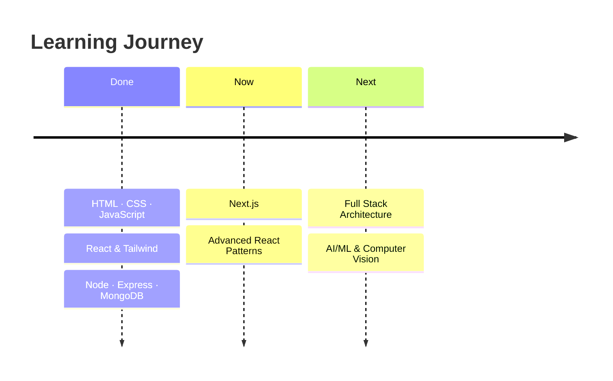

<div align="center">


<br/><br/>

<a href="#-about"></a>
<a href="#-skills"></a>
<a href="#-stats"></a>
<a href="#-roadmap"></a>
<a href="#-contact"></a>

<br/><br/>


</div>

<br/>

## ✦ About

<table>
<tr>
<td width="55%" valign="top">

```ansi
┌──────────────────────────────────────┐
│  ● ● ●            abdullah@dev:~     │
├──────────────────────────────────────┤
│ $ cat profile.json                   │
│ {                                    │
│   "name":    "Abdullah",             │
│   "roles":   ["MERN Dev", "SQA"],    │
│   "stack":   "MongoDB · Express ·    │
│               React · Node",         │
│   "ui":      "clean & responsive",   │
│   "learning":"Next.js ⚡",           │
│   "status":  "open to collab 🤝"     │
│ }                                    │
│ $ _                                  │
└──────────────────────────────────────┘
```

</td>
<td width="45%" valign="top">

#### 🔥 Quick Facts
🎨 Love turning **Figma → pixel-perfect UI**<br/>
🧪 Break software as an **SQA**, build it as a **dev**<br/>
⚡ Currently diving into **Next.js**<br/>
🧩 Mastering **Advanced React patterns**<br/>
🏗️ Exploring **full-stack architecture**

</td>
</tr>
</table>

<br/>

## ✦ Skills

<div align="center">


<br/><br/>

| 🎨 Frontend | ⚙️ Backend | 🗄️ Database | 🧰 Tools |
|:---:|:---:|:---:|:---:|
| HTML · CSS · JS | Node.js | MongoDB | Git · GitHub |
| React · Tailwind | Express.js | MySQL | VS Code · Figma |
| Responsive UI | REST APIs · Python | Schema Design | Manual SQA Testing |

</div>

<br/>

## ✦ Stats

<div align="center">


</div>

<br/>

## ✦ Roadmap



<br/>

## ✦ Contact

<div align="center">

<a href="https://www.linkedin.com/in/abdullah-azhar23/"></a>
<a href="mailto:abdullahrajpoot8776@gmail.com"></a>
<a href="https://portfolio23-three-liart.vercel.app"></a>

<br/><br/>

*"Good UI is invisible. Good testing is invisible. Good code makes both possible."*


</div>
